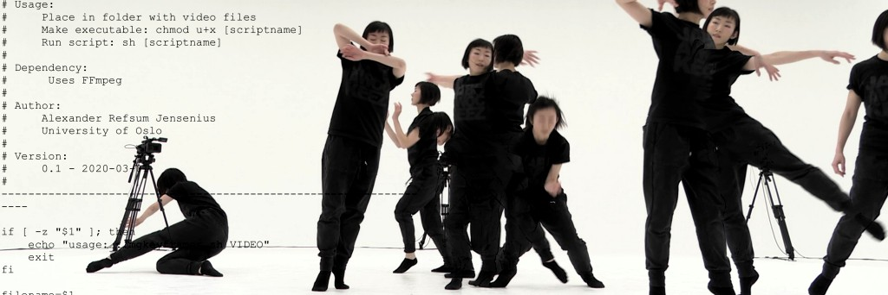

# MGT-terminal

The Musical Gestures Toolbox for Terminal is made for doing various video-related tricks in the terminal. This is mainly based on the power of [FFmpeg](http://ffmpeg.org/) and [ImageMagick](https://imagemagick.org/index.php).

The toolbox was primarily developed for music research, with a
particular focus on studying the motion of musicians and dancers. But it
can be used for any type of motion-related analysis based on video
recordings.

## Dependencies

The toolbox is based on two core libraries:

-   [FFmpeg](http://ffmpeg.org/)
-   [ImageMagick](https://imagemagick.org/index.php)

On Ubuntu you can install these as simply as doing:

    sudo apt install ffmpeg imagemagick

On other systems you may have to download through the links above.

## History

The toolbox builds on the other Musical Gestures Toolboxes (for
[Max](https://www.uio.no/ritmo/english/research/labs/fourms/downloads/software/musicalgesturestoolbox/mgt-max/index.html),
[Matlab](https://www.uio.no/ritmo/english/research/labs/fourms/downloads/software/musicalgesturestoolbox/mgt-matlab/index.html),
[Python](https://github.com/fourMs/MGT-python)). All of these
scripting-based toolboxes are slightly different in implementation, but
they share the vision of creating powerful, yet fairly simple to use,
operations for video visualization.

The software is maintained by the [fourMs
lab](https://github.com/fourMs) at [RITMO Centre for Interdisciplinary
Studies in Rhythm, Time and Motion](https://www.uio.no/ritmo/english/)
at the University of Oslo.

## Reference

This toolbox has not been published on, but you could reference one of
these publications for info about the functionality:

-   Jensenius, Alexander Refsum (2013). [Some Video Abstraction
    Techniques for Displaying Body Movement in Analysis and
    Performance](http://urn.nb.no/URN:NBN:no-38076). *Leonardo* 46, no.
    1: 53--60.
-   Jensenius, Alexander Refsum (2018). [The Musical Gestures Toolbox
    for Matlab](http://hdl.handle.net/10852/65559). Proceedings of the
    19th International Society for Music Information Retrieval
    Conference, Late Breaking Demos Session. Paris, France.
